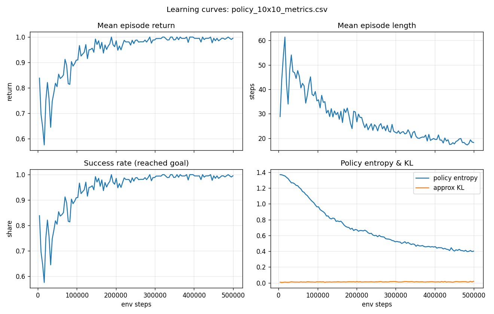
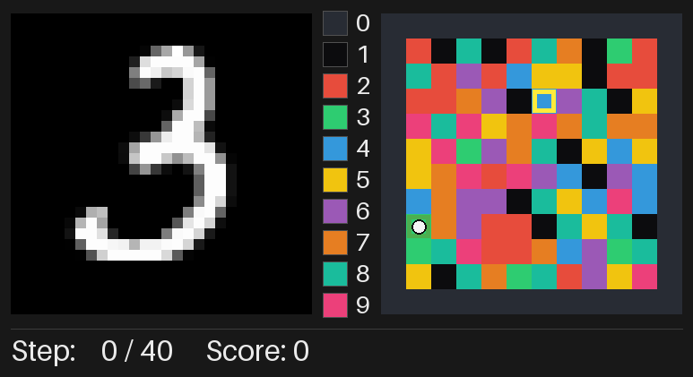
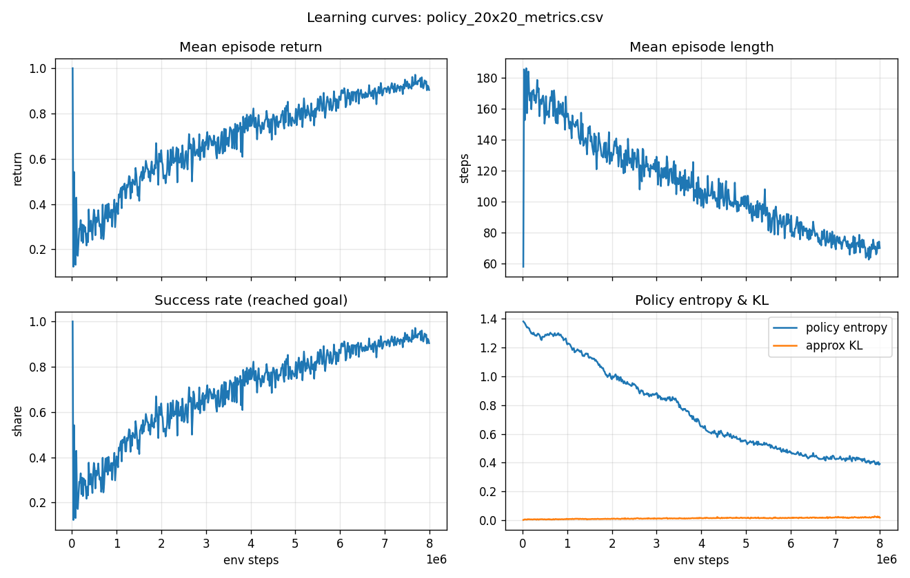
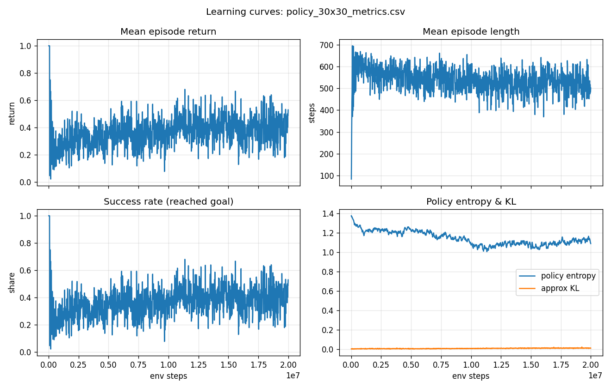

# MNIST MiniGrid

A vectorized, GridWorld-style maze environment whose observations are MNIST
handwritten digit images. Each cell has a *color* (a digit class); on every
step the agent sees one MNIST sample drawn from the class of the cell it
currently perceives.


## Environment

* Rectangular play area of size `(height, width)` surrounded by walls.
* Obstacles inside the area are specified by a binary `(height, width)` mask.
* Cells fall into three types: **floor**, **wall**, **obstacle**.
* There are `n_colors ≤ 10` colors total. Walls and obstacles each have one
  dedicated color; floor cells use the remaining `n_colors - 2` colors.
* The coloring of the internal area is passed in at construction time and
  stays fixed throughout training.

When `n_colors = 3` only a single floor color is left, so every walkable cell
looks the same and the MNIST digit class the agent sees on the floor never
changes between cells:


### Actions

Four discrete actions, numbered clockwise starting from "up":

| id | name  | (Δrow, Δcol) |
|----|-------|--------------|
| 0  | up    | (-1,  0)     |
| 1  | right | ( 0, +1)     |
| 2  | down  | (+1,  0)     |
| 3  | left  | ( 0, -1)     |

If the move targets a wall (outside the area) or an obstacle, the agent
**stays in place** but its observation is taken from the blocked cell — so it
*sees* the wall or obstacle. Below, the agent is placed at the top edge and
keeps sending action `0` ("up"); it never moves, and the MNIST panel cycles
through samples of the wall class (digit `0`, since `wall_color = 0`):


### Observation

Each step returns a dict:

```python
{
  "image": np.uint8[28, 28],                  # MNIST sample of the perceived cell
  "goal":  np.float32[height + width],        # two-hot encoding of the goal (row, col)
}
```

The `image` for each color index is sampled uniformly from the MNIST training
images of the corresponding digit class. The `goal` is a standard two-hot
encoding: a 1 at the goal's row index in the first `height` slots, and a 1 at
its column index in the last `width` slots.

Because the image is resampled at every step, even an agent that stays at the
exact same cell keeps seeing different MNIST samples of the *same* digit
class — the class index stays constant while the handwriting changes:


### Reward & termination

* Reward is sparse: `+1` on the step that reaches the goal, `0` otherwise.
* The episode **terminates** when the agent reaches the goal.
* The episode **truncates** at `max_steps`.

## Vectorization

`MNISTMazeVecEnv` subclasses `gymnasium.vector.VectorEnv` and runs
`num_envs` sub-environments in lockstep. It exposes the standard
`single_observation_space`, `single_action_space`, `observation_space`, and
`action_space` attributes. Autoreset uses `NEXT_STEP` semantics: a
sub-environment that terminates or truncates on step `t` is automatically reset
at the start of step `t + 1` (its action is ignored that step, the returned
observation is the reset observation, and `reward = 0`, `terminated =
truncated = False`).

## Installation

Requirements: Python ≥ 3.10. 

```bash
pip install -e .  
```

The first time `MNISTMazeVecEnv` is constructed it downloads the MNIST
training files (~11 MB) into `~/.cache/mnist-maze/`. To use a different cache
location, pass it explicitly:

```python
from env import load_mnist_by_class, MNISTMazeVecEnv

mnist_banks = load_mnist_by_class(cache_dir="./.mnist_cache")
env = MNISTMazeVecEnv(..., mnist_images_by_class=mnist_banks)
```

The loader needs just two files —
`train-images-idx3-ubyte.gz` and `train-labels-idx1-ubyte.gz`. If they are
already present in the cache directory, no network access is required.

## Usage

```python
import numpy as np
from env import (
    MNISTMazeVecEnv,
    random_color_map,
    random_obstacle_mask,
)

rng = np.random.default_rng(0)
height, width = 20, 20
obstacles = random_obstacle_mask(height, width, fraction=0.12, rng=rng)
colors = random_color_map(height, width, n_colors=10, rng=rng)

env = MNISTMazeVecEnv(
    num_envs=8,
    height=height,
    width=width,
    obstacle_mask=obstacles,
    color_map=colors,
    n_colors=10,
    max_steps=4 * height * width,
    seed=0,
)

obs, info = env.reset(seed=0)
for _ in range(1000):
    actions = rng.integers(0, 4, size=env.num_envs)
    obs, reward, terminated, truncated, info = env.step(actions)
```

## Rendering

`MNISTMazeVecEnv.render_frame(env_idx=0, cell_size=24)` returns a
`(H, W, 3) uint8` RGB frame for one sub-environment. The layout is:

* **Left**: the MNIST image the agent is currently observing (scaled up).
* **Centre**: a *color → digit* legend showing which palette entry corresponds
  to each MNIST class (the wall and obstacle color indices are included).
* **Right**: the colored maze with a one-cell-thick dark slate wall border,
  obstacles (color index 1, near-black), the **start cell** of the current
  episode (green hollow square), the **goal** (yellow hollow square), and the
  **agent** (white circle).
* **Bottom**: a status bar with the current step count and the episode score
  (cumulative reward of the current episode, tracked in
  `env.episode_return[env_idx]`).

## Training a PPO agent

The `agent/` package contains the training pipeline: a pre-trained MNIST
classifier (used as a frozen observation encoder), a recurrent (GRU)
actor-critic policy, PPO + GAE.

### Architecture

* **Observation encoder** — a small CNN (`agent.mnist_classifier.MNISTClassifier`)
  is pre-trained on MNIST and **frozen**. At every step the agent's raw
  `28 × 28` MNIST observation is converted to a single predicted digit
  (`argmax` of the classifier logits). The policy therefore sees the *digit
  class* (0–9), not the pixels.
* **Policy** — `agent.policy.GRUPolicy`:
  * `Embedding(10, 10)` — one-hot digit encoding
  * `Linear(h + w, 32)` — projects the two-hot goal to a 32-d vector
  * Concatenated (42-d), fed into `GRU(42, hidden=128, num_layers=1)`
  * Two direct linear heads: `Linear(128, 4)` (actor), `Linear(128, 1)` (critic)
  * Hidden state and prev-action token are reset at every episode boundary
* **Algorithm** — `agent.ppo`: recurrent PPO with GAE
  (γ=0.99, λ=0.95, ε=0.2), advantages normalised globally per rollout,
  minibatches over *envs* so the time axis stays intact for the GRU.


### Why this design

* **Frozen MNIST classifier as the observation encoder.** The cell observation
  is intentionally a noisy view of a single discrete signal — the cell's
  *color index*, which is also the MNIST digit class. This decouples representation learning from RL credit
  assignment, makes the policy small and fast, and avoids the well-known
  sample-inefficiency of pixel-based RL on a sparse-reward task.

* **Recurrent (GRU) policy.** The env is strongly partially observable —
  one cell per step, no compass, no map. The agent has to **integrate over
  time** the digits it has seen, the wall/obstacle bumps, and the actions it
  took in order to localise itself relative to the (known) goal coordinates.
  A GRU is the smallest standard recurrent block that handles this.
* **PPO + GAE.** PPO is the standard robust on-policy choice and works well
  with recurrent networks. The clipped surrogate objective keeps updates
  stable without explicit trust-region machinery, and GAE turns the very
  sparse reward (one ±1 spike per episode) into a smoothly bootstrapped
  advantage signal that PPO can actually learn from.

### Pre-train the MNIST classifier (once)

```bash
python -m agent.pretrain_mnist --epochs 3 \
    --output checkpoints/mnist_classifier.pt
```

The script trains on a 90 % slice of the 60k MNIST training set, evaluates on
the remaining 10 % as a held-out validation set, **and** reports accuracy on
the official 10 000-sample MNIST test set:

```
held-out val accuracy (6000 samples): 0.9852
official test accuracy (10000 samples): 0.9875
```

So the committed checkpoint reaches **~98.8 % test accuracy** after three
epochs (~50 s on CPU) — more than enough for the downstream RL task, where
the only thing we care about is mapping a clean MNIST sample to its digit
class.

### Train PPO on a single board size

One run trains one board size; use `--size 10 / 20 / 30` for the three
requested scales. Below are the **recommended configs** that were validated
experimentally:

```bash
python -m agent.train --size 10 --total-steps 500_000
python -m agent.train --size 20 \
    --total-steps 8_000_000 --num-envs 128 \
    --max-episode-steps 200 --entropy-coef 0.02 \
    --action-embed-dim 0 --curriculum-start 40 
python -m agent.train --size 30 \
    --total-steps 20_000_000 --num-envs 128 \
    --max-episode-steps 700 --entropy-coef 0.02 \
    --action-embed-dim 0 --curriculum-start 60 s
```

The obstacle mask and color map are sampled once at startup from `--seed`
and stay fixed for the entire run. Each run produces two artefacts in
`checkpoints/`:

* `policy_<H>x<W>.pt` — policy weights + the layout + CLI arguments;
* `policy_<H>x<W>_metrics.csv` — per-rollout training metrics, consumed by
  `agent.eval` to plot learning curves.

Key flags (see `--help` for the rest):

| flag | default | meaning |
|------|---------|---------|
| `--size` | `10` | side length of the square maze |
| `--total-steps` | `300_000` | total environment steps |
| `--num-envs` | `32` | parallel sub-environments (must be divisible by `--minibatches`) |
| `--rollout-length` | `128` | env steps per PPO rollout |
| `--epochs` | `10` | PPO update epochs per rollout |
| `--minibatches` | `4` | minibatches per epoch (each = `num_envs / minibatches` envs) |
| `--max-episode-steps` | `10 * size` | episode length limit |
| `--lr` | `5e-4` | Adam learning rate |
| `--gamma` / `--gae-lambda` | `0.99 / 0.95` | discount and GAE λ |
| `--entropy-coef` | `0.01` | entropy bonus weight |
| `--clip-eps` | `0.2` | PPO clip range |
| `--action-embed-dim` | `32` | prev-action embedding size; set to `0` to remove it (recommended for ≥ 20×20) |
| `--hidden-dim` | `128` | GRU hidden state size |
| `--num-layers` | `1` | stacked GRU layers |
| `--curriculum-start` | `2` | initial max Manhattan distance from start to goal |
| `--curriculum-end` | `h + w` | final max Manhattan distance (the full board diameter) |
| `--curriculum-fraction` | `0.5` | fraction of `--total-steps` over which `max_goal_distance` ramps linearly |
| `--mnist-checkpoint` | `checkpoints/mnist_classifier.pt` | frozen encoder weights |
| `--device` | `cpu` | use `cuda` / `mps` if available |
| `--seed` | `0` | seed for env layout, RNG, and policy init |

A healthy run should show `succ` rising from `~0.15` (random policy) to
`>0.9` and `entropy` falling from `≈ln 4 = 1.386` down to ~0.3-0.5 over the
budget. If `approx_kl` stays close to `0` for a long time, the updates are
too conservative — try `--lr 1e-3` or `--epochs 20`.

Per-rollout metrics print as:

```
[   98304/300000]  d_max= 13  ep_ret=0.45  ep_len=31.6  succ=0.45  n_ep=126  pi_loss=-0.017  v_loss=0.024  H=1.155  kl=+0.008  sps=2706
```


## Results

| size | succ | steps | config |
|------|------|-------|--------|
| 10×10 | **1.00** | 500 k | defaults + curriculum |
| 20×20 | **0.91–0.96** | 8 M | no curriculum, `action_embed_dim=0`, `num_envs=128` |
| 30×30 | ~0.40 | 20 M | no curriculum, `max_episode_steps=700` |

### 10×10





### 20×20




### 30×30




### Evaluate a trained policy: learning curves + GIF

`agent.eval` takes a policy checkpoint, plots the recorded learning curves
and records a GIF of the trained agent acting in the env:

```bash
python -m agent.eval --policy checkpoints/policy_10x10.pt
```

**Validation runs on the same environment the agent was trained on.** The
training checkpoint stores the original `obstacle_mask` and `color_map`
together with the relevant CLI arguments (`size`, `n_colors`,
`max_episode_steps`, `mnist_checkpoint`, `hidden_dim`), and `agent.eval`
rebuilds the env from those exact values. The only thing that differs from
training is the RNG seed (`--seed`, default `12345`), so that the recorded
episodes have fresh start/goal positions on the same fixed layout — i.e.
this is an *in-distribution* evaluation, not a generalisation test on unseen
mazes.

By default this writes, next to the policy file:

* `policy_<H>x<W>_curves.png` — 4-panel figure with mean episode return,
  mean episode length, success rate, and policy entropy + approx KL versus
  env steps (read straight from the metrics CSV).
* `policy_<H>x<W>_rollout.gif` — N completed episodes of the trained
  policy, rendered with the same MNIST-observation/legend/maze layout as the
  random-agent GIFs above.

Useful flags:

| flag | default | meaning |
|------|---------|---------|
| `--num-episodes` | `3` | how many completed episodes to capture in the GIF |
| `--max-frames` | `400` | hard cap on total GIF frames (safety against very long episodes) |
| `--deterministic` | off | greedy `argmax` actions; otherwise sample from the actor distribution |
| `--cell-size` | `28` | pixel size of one maze cell in the GIF |
| `--fps` | `3.0` | GIF playback speed |
| `--gif` / `--plot` / `--metrics` | derived from `--policy` | override output paths |
| `--device` | `cpu` | use `cuda` / `mps` if available |

