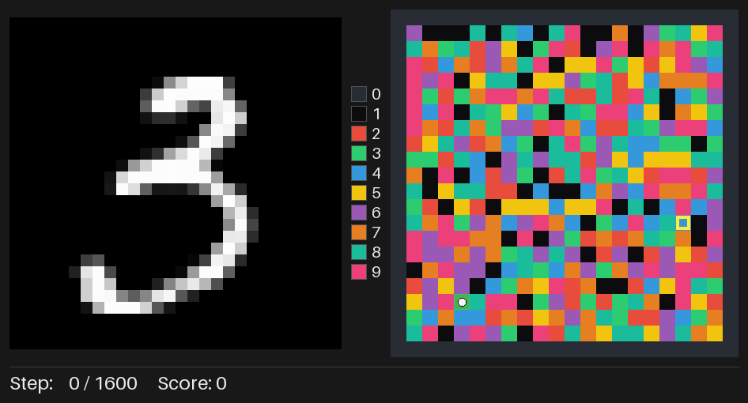
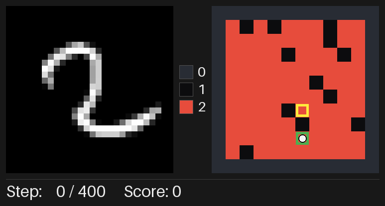
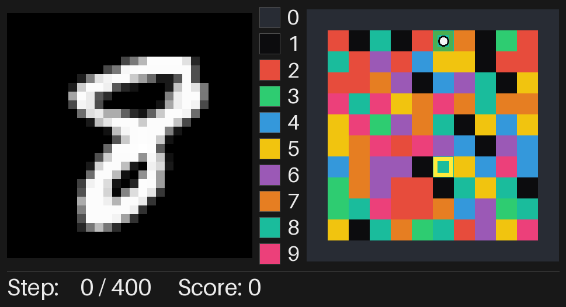
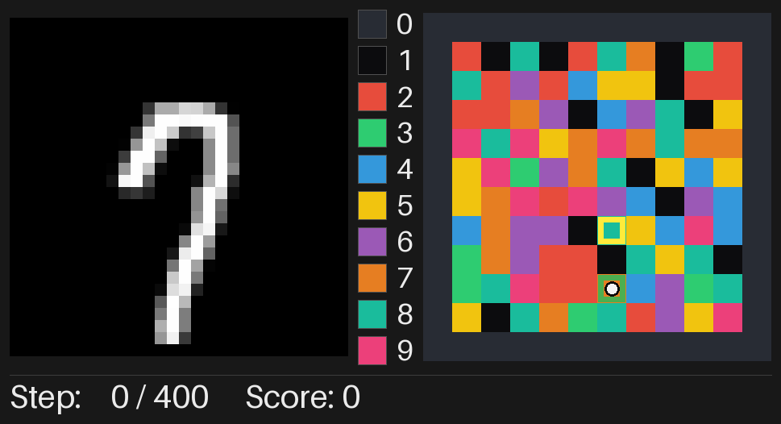

# MNIST MiniGrid

A vectorized, GridWorld-style maze environment whose observations are MNIST
handwritten digit images. Each cell has a *color* (a digit class); on every
step the agent sees one MNIST sample drawn from the class of the cell it
currently perceives.



## Environment

* Rectangular play area of size `(height, width)` surrounded by walls.
* Obstacles inside the area are specified by a binary `(height, width)` mask.
* Cells fall into three types: **floor**, **wall**, **obstacle**.
* There are `n_colors ≤ 10` colors total. Walls and obstacles each have one
  dedicated color; floor cells use the remaining `n_colors - 2` colors.
* The coloring of the internal area is passed in at construction time and
  stays fixed throughout training.

When `n_colors = 3` only a single floor color is left, so every walkable cell
looks the same and the MNIST digit class the agent sees on the floor never
changes between cells:



### Actions

Four discrete actions, numbered clockwise starting from "up":

| id | name  | (Δrow, Δcol) |
|----|-------|--------------|
| 0  | up    | (-1,  0)     |
| 1  | right | ( 0, +1)     |
| 2  | down  | (+1,  0)     |
| 3  | left  | ( 0, -1)     |

If the move targets a wall (outside the area) or an obstacle, the agent
**stays in place** but its observation is taken from the blocked cell — so it
*sees* the wall or obstacle. Below, the agent is placed at the top edge and
keeps sending action `0` ("up"); it never moves, and the MNIST panel cycles
through samples of the wall class (digit `0`, since `wall_color = 0`):



### Observation

Each step returns a dict:

```python
{
  "image": np.uint8[28, 28],                  # MNIST sample of the perceived cell
  "goal":  np.float32[height + width],        # two-hot encoding of the goal (row, col)
}
```

The `image` for each color index is sampled uniformly from the MNIST training
images of the corresponding digit class. The `goal` is a standard two-hot
encoding: a 1 at the goal's row index in the first `height` slots, and a 1 at
its column index in the last `width` slots.

Because the image is resampled at every step, even an agent that stays at the
exact same cell keeps seeing different MNIST samples of the *same* digit
class — the class index stays constant while the handwriting changes:



### Reward & termination

* Reward is sparse: `+1` on the step that reaches the goal, `0` otherwise.
* The episode **terminates** when the agent reaches the goal.
* The episode **truncates** at `max_steps`.

## Vectorization

`MNISTMazeVecEnv` subclasses `gymnasium.vector.VectorEnv` and runs
`num_envs` sub-environments in lockstep. It exposes the standard
`single_observation_space`, `single_action_space`, `observation_space`, and
`action_space` attributes. Autoreset uses `NEXT_STEP` semantics: a
sub-environment that terminates or truncates on step `t` is automatically reset
at the start of step `t + 1` (its action is ignored that step, the returned
observation is the reset observation, and `reward = 0`, `terminated =
truncated = False`).

## Installation

Requirements: Python ≥ 3.10. 

```bash
pip install -e .  
```

The first time `MNISTMazeVecEnv` is constructed it downloads the MNIST
training files (~11 MB) into `~/.cache/mnist-maze/`. To use a different cache
location, pass it explicitly:

```python
from env import load_mnist_by_class, MNISTMazeVecEnv

mnist_banks = load_mnist_by_class(cache_dir="./.mnist_cache")
env = MNISTMazeVecEnv(..., mnist_images_by_class=mnist_banks)
```

The loader needs just two files —
`train-images-idx3-ubyte.gz` and `train-labels-idx1-ubyte.gz`. If they are
already present in the cache directory, no network access is required.

## Usage

```python
import numpy as np
from env import (
    MNISTMazeVecEnv,
    random_color_map,
    random_obstacle_mask,
)

rng = np.random.default_rng(0)
height, width = 20, 20
obstacles = random_obstacle_mask(height, width, fraction=0.12, rng=rng)
colors = random_color_map(height, width, n_colors=10, rng=rng)

env = MNISTMazeVecEnv(
    num_envs=8,
    height=height,
    width=width,
    obstacle_mask=obstacles,
    color_map=colors,
    n_colors=10,
    max_steps=4 * height * width,
    seed=0,
)

obs, info = env.reset(seed=0)
for _ in range(1000):
    actions = rng.integers(0, 4, size=env.num_envs)
    obs, reward, terminated, truncated, info = env.step(actions)
```

## Rendering

`MNISTMazeVecEnv.render_frame(env_idx=0, cell_size=24)` returns a
`(H, W, 3) uint8` RGB frame for one sub-environment. The layout is:

* **Left**: the MNIST image the agent is currently observing (scaled up).
* **Centre**: a *color → digit* legend showing which palette entry corresponds
  to each MNIST class (the wall and obstacle color indices are included).
* **Right**: the colored maze with a one-cell-thick dark slate wall border,
  obstacles (color index 1, near-black), the **start cell** of the current
  episode (green hollow square), the **goal** (yellow hollow square), and the
  **agent** (white circle).
* **Bottom**: a status bar with the current step count and the episode score
  (cumulative reward of the current episode, tracked in
  `env.episode_return[env_idx]`).


